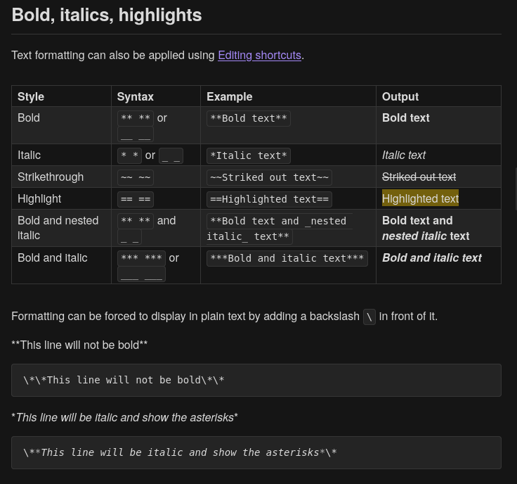
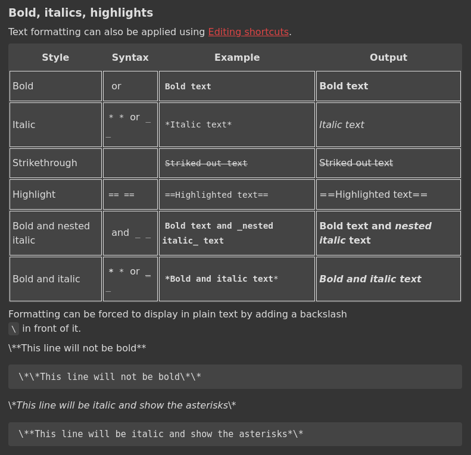
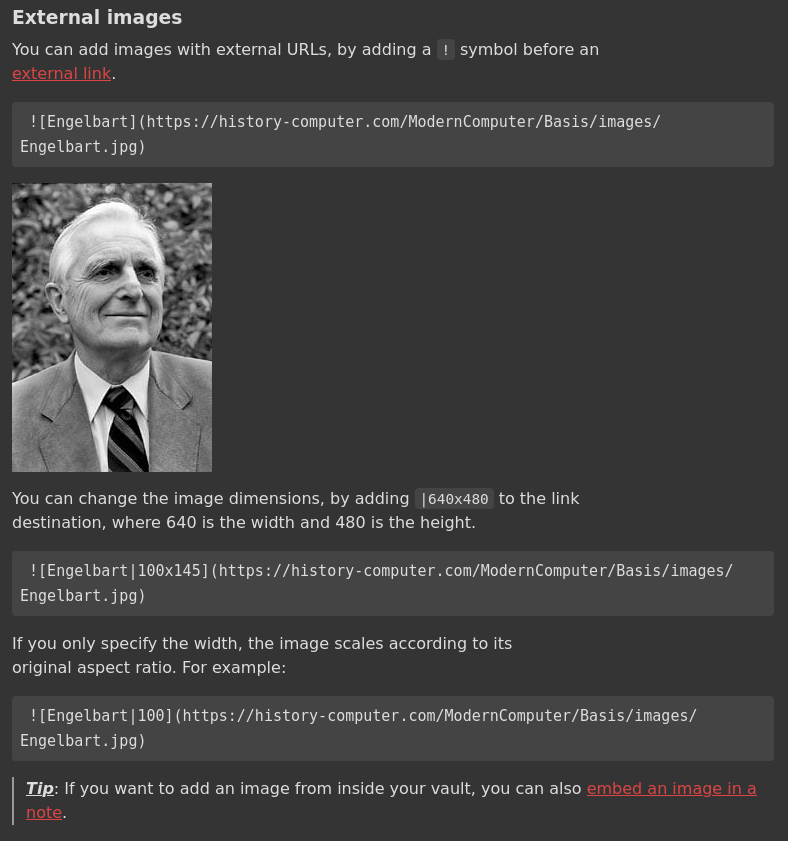

## Overview

Myco-Pandoc provides custom Lua filters for Pandoc that enable conversion between Mycomarkup and other document formats especially markdown. [Mycomarkup](https://mycorrhiza.wiki/help/en/mycomarkup) is a lightweight markup language with simple, readable syntax designed for personal knowledge management.

| Obsidian Flavored Markdown                                                         | Myco                                                                       |
| ---------------------------------------------------------------------------------- | -------------------------------------------------------------------------- |
|  |  |
|                  |                  |

## Features

### Writer Support

| Category            | Element             | Status | Notes                                                                                                  |
| ------------------- | ------------------- | ------ | ------------------------------------------------------------------------------------------------------ |
| **Block Elements**  | Code block          | ✅     |                                                                                                        |
|                     | Block quotes        | ✅     |                                                                                                        |
|                     | Ordered list        | ✅     |                                                                                                        |
|                     | Bullet list         | ✅     |                                                                                                        |
|                     | Task list           | ✅     | Converts ☒/☐ to Mycomarkup format                                                                      |
|                     | Definition list     | ❌     |                                                                                                        |
|                     | Headers             | ✅     |                                                                                                        |
|                     | Horizontal rule     | ✅     |                                                                                                        |
|                     | Tables              | ✅     |                                                                                                        |
| **Inline Elements** | Emphasis (italic)   | ✅     |                                                                                                        |
|                     | Underline           | ✅     |                                                                                                        |
|                     | Strong (bold)       | ✅     |                                                                                                        |
|                     | Strikeout           | ✅     |                                                                                                        |
|                     | Superscript         | ✅     |                                                                                                        |
|                     | Subscript           | ✅     |                                                                                                        |
|                     | Small caps          | ❌     |                                                                                                        |
|                     | Citations           | ❌     |                                                                                                        |
|                     | Monospace/Code      | ✅     |                                                                                                        |
|                     | Math                | ❌     |                                                                                                        |
|                     | Links               | ✅     |                                                                                                        |
|                     | Images              | ✅     |                                                                                                        |
|                     | Footnotes           | ❓     | Implemented as superscript for now. [Not supported](https://todo.sr.ht/~bouncepaw/mycomarkup/5)        |
| **Others**          | Note block/Callouts | ❓     | Implemented as bold italic and underlined. [Not supported](https://todo.sr.ht/~bouncepaw/mycomarkup/2) |

### Reader Support

Not implemented.

## Installation

1. First, ensure [Pandoc](https://pandoc.org/installing.html) is installed on your system.

2. Clone this repository:
   ```bash
   git clone https://github.com/barab-i/myco-pandoc.git
   ```

## Usage

Markdown to mycomarkup:

```bash
pandoc --wrap=none -f markdown -t /path/to/myco-pandoc/writer.lua -i input.md -o output.myco
```

## Contributing

Contributions are welcome! Please feel free to submit a Pull Request.
